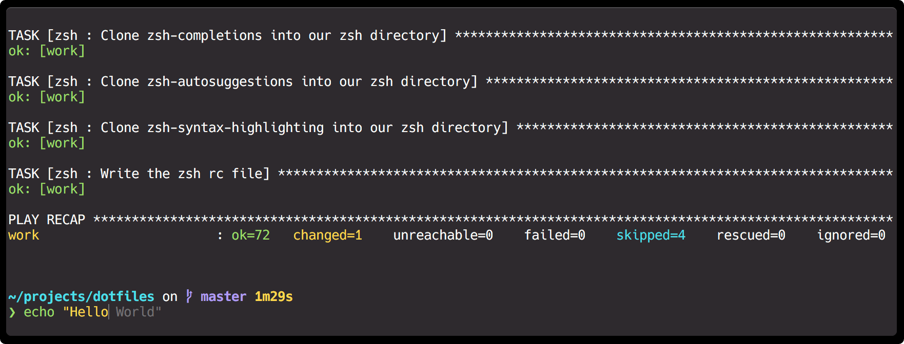

# Dotfiles

Welcome to my dotfiles!

This repo contains all of the configuration that I use to get my mac from first boot to 100% configured. Almost everything is automated using Ansible, but some system preferences must be done manually and those are documented in this repo.

This repo contains **my dotfiles** and the contents change in master without warning as I update my own tools and preferences. However the dotfiles are arranged such that you *should* be able to fork this repo, change variables, and get going with your own
configuration.

## Tools That I Use

I rely heavily on the following tools. If you don't use them you will have a hard time removing removing them from the repo. Other tools should be easy to add/remove.

### Ansible

This whole project runs on [Ansible](https://www.ansible.com). Ansible is the tool that takes these config files and copies them to the right place on your mac.

### 1Password

I use [1Password](https://1password.com) to store all of my secrets. There are no secrets in this repo because they all in 1Password and pulled at runtime using the [op](https://1password.com/downloads/command-line/) CLI. If you don't use 1Password any of the commands the pull secrets will need to be refactored. Don't put secrets in directly in your repo.

### Homebrew

I use [Homebrew](https://brew.sh) to install all mac applications and utilities that are available on the platform. Nothing would be installed without it.

### Zsh

I use [Zsh](https://github.com/zsh-users/zsh) as my shell and much of the configuration is geared towards making zsh easier to use.

### Other Tools

For a full list of other tools that I install and configure in this repo check folder names in [roles/](roles/) and lines in [homebrew.yml](group_vars/homebrew.yml), [go.yml](group_vars/go.yml), [node.yml](group_vars/node.yml), and [python.yml](group_vars/python.yml).

## How Everything Works

Everything works in one of two ways. The first is you write custom Ansible that configures your apps, usually by copying a config file to a directory. The second is you create a file in `roles/**/zsh/file.zsh` that is automatically sourced when you open a new shell.

All of this configuration is enforced by the [dot](roles/bin/templates/dot.j2) command, which is intended to be run regulary and keeps this repo in sync with your mac through Ansible. After you change something in this repo run `dot` to sync it with your mac.

### The Dot Command

By default `dot` will run all Ansible that does not require user input or configure MacOS system preferences. This means you can be carefree about running `dot` and knowing it won't take long (~1.5 minutes on my machine) and that you won't have to interact with it. During initial setup and occasionally afterwards you should run `dot all`, which will prompt for your 1Password and sudo passwords and then configure the entire machine.

### Tags

Many tasks in the playbook are tagged by their external dependencies. For example, tasks that require root are tagged `sudo`. The same is true for the `1password` and `internet` tags.

Every role is also tagged with its own name. Meaning you can run `dot -t ROLE_NAME` to run dot against only a specific role.

## Setting Up A New Mac

Follow the instructions in [INSTALL.md](docs/INSTALL.md) to setup a new mac for the first time.

## Ideas

Some things that I plan to add here eventually

- Vim & vim configuration
- More CI (run against a new mac)
- Some manual steps can still be automated with `osx_defaults`
- Make these work on linux systems
- Remote linux workstation with these dotfiles

## Inspiration

These dotfiles are written 100% from scratch unless otherwise mentioned in the file comments. Heavy inspiration provided by [holman/dotfiles](https://github.com/holman/dotfiles) and [geerlingguy/mac-dev-playbook](https://github.com/geerlingguy/mac-dev-playbook).
